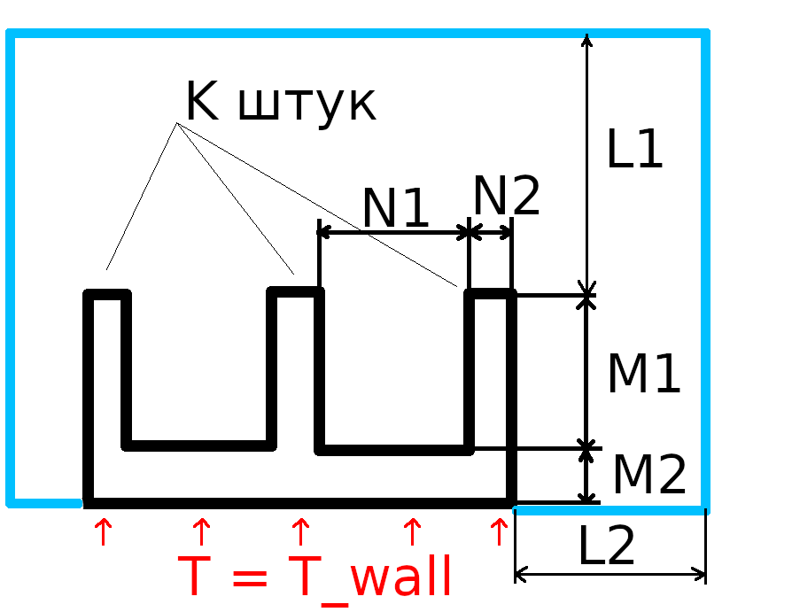
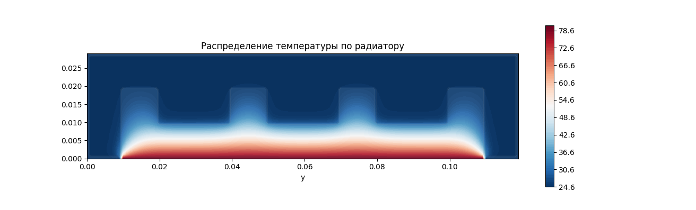

Второе задание - программа
==========================


Для всех задач использовать библиотечные функции `numpy` и `scipy.optimize` можно. Все примечания и намёки справедливы, если вы решаете задачу тем способом, который предположил я, но способов может быть несколько.

Задачт 3 и 4 оформлять в отдельную функцию не обязательно.

## 1. Определяем неопределённые (на 3х человек)
На двумерной сетке с шагами hx, ht задан шаблон в виде сдвигов индетксов точек. Кроме того, дана дифференциальная задача в виде списка коэффициентов при различных производных (не выше второй). Найти коэффициенты численной схемы.
Пример (Задача №10.1.2):

```python3
def MNK(stencil, problem, hx, ht):
	# Your code
	return scheme

stencil = (         ( 0, 1),
           (-1, 0), ( 0, 0), ( 1, 0),
                    ( 0,-1)          )
problem = {(0, 2) : 1,
           (2, 0) : 1}

hx, ht = 1., 1.
c = MNK(stencil, problem, hx=hx, ht=ht)
print(c) # [ 1. -1. -0. -1.  1.]
```

Намёк: если идти методом неопределённых коэффициентов, то задача разбивается на

1. Нахождение коэффициентов в формуле Тейлора для каждой точки шаблона
2. Составление матрицы A из коэффициентов п.1
3. Составление столбца b из коэффициентов problem
4. Удаление линейно зависимых строк матрицы (A,b)
5. Решения системы A*c = b

## 2. Устойчивость (на 2 человек)
На двумерной сетке задан шаблон в виде сдвигов индетксов точек. Кроме того, даны коэффициенты численной схемы. Проверить схему на устойчивость/неустойчивость. Можно использовать библиотечные функции `numpy` и `scipy.optimize`.
Пример:

```python3
def isStable(stencil, scheme):
	# Your code
	return True or False

hx, ht = 1., 1.
a = 0.5
C = a*ht/hx
print('C =', C)
scheme = (1/ht, -a/hx, a/hx - 1/ht)
stencil = (         ( 0, 1),
           (-1, 0), ( 0, 0))

stab = isStable(stencil, scheme)
print('Stable' if stab else 'Unstable') # Stable
```

Примечание: функция `numpy.polynomial.polynomial.polyroots` может оказаться крайне полезной

## 3. Buzzz (на 3х человек)
Посередине плоской комнаты размером `Nx*Ny` узлов стоит прямоугольная колонная размером `Mx*My` узлов. В точке `X0, Y0` во время `0 <= t <= t_max` излучается синусоидальный сигнал с частотой `w`, который записыватеся микрофоном, расположенным в точке `X1, Y1`. Изобразить записанный сигнал. Шаг сетки равен `h`, шаг по врмени равен `tau`, скорость звука в воздухе `a = 340 м/с`. От колонны и стен комнаты звук полностью отражается. Теорию можно посмотреть в файле buzzz.pdf


## 4. Кулер (на 3х человек)
Простой кулер для микросхем представляет собой обдуваемую воздухом металлическую гребёнку-радиатор с заданными размерами, вытянутую в продольном направлении (см. рисунок 1). Известны все параметры радиатора и воздуха. Найти распределение тепла по объёму радиатора и воздуха. Учитывать унос тепла нагнетаемым воздухом. Построить картинки (см. рисунок 2). Задачу считать двумерной. Немного теории есть в файле heatsink.pdf




Примечание:
1. Размеры удобно задавать в числе ячеек.
2. Не обязательно следить за корректностью уравнений на границе металл-воздух.
3. Граничные условия - постоянная температура нижней части радиатора (там схема) и постоянная температура всей остальной границы (там холодный воздух)
